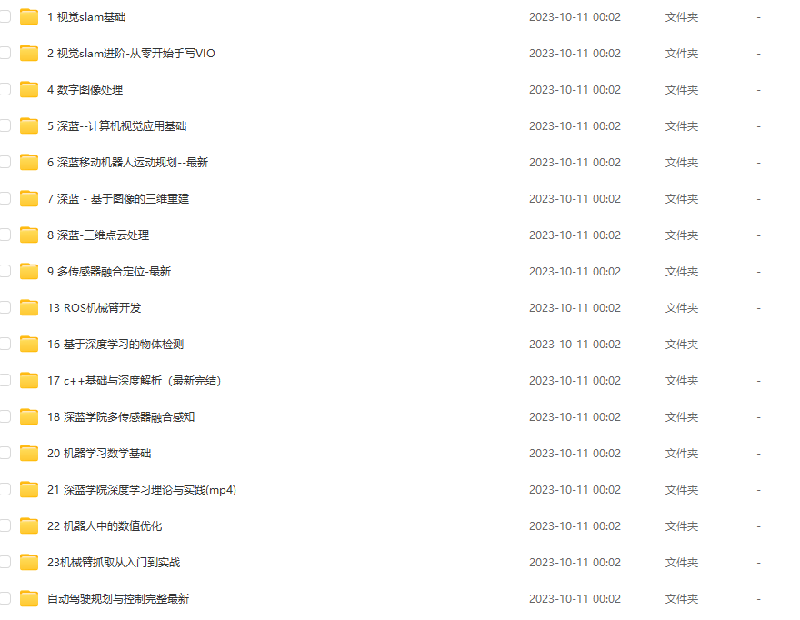
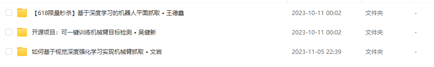

# 2 教程资源

### 1 B站

#### 1.1 AI

1 AI论文精读-李沐

链接：[点击传送](https://space.bilibili.com/1567748478/channel/collectiondetail?sid=32744)

2 动手学深度学习 PyTorch版 

链接：[点击传送](https://space.bilibili.com/1567748478/channel/seriesdetail?sid=358497)

#### 1.2 ROS

1 【Autolabor初级教程】ROS机器人入门  ->  Autolabor官方

链接：[点击传送](https://www.bilibili.com/video/BV1Ci4y1L7ZZ/?spm_id_from=333.337.search-card.all.click&vd_source=7df640296c15e75b5fbd2da8cc72a434)

#### 1.3 STM32

1 STM32入门教程-2023版 细致讲解 中文字幕  ->  江协科技

链接：[点击传送](https://www.bilibili.com/video/BV1th411z7sn/?spm_id_from=333.337.search-card.all.click&vd_source=7df640296c15e75b5fbd2da8cc72a434)

### 2 百度网盘

#### 2.1 深蓝学院

#### 2.2 古月居
