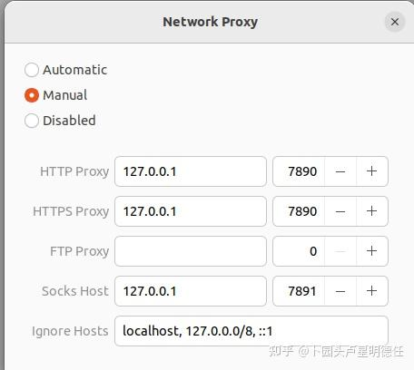
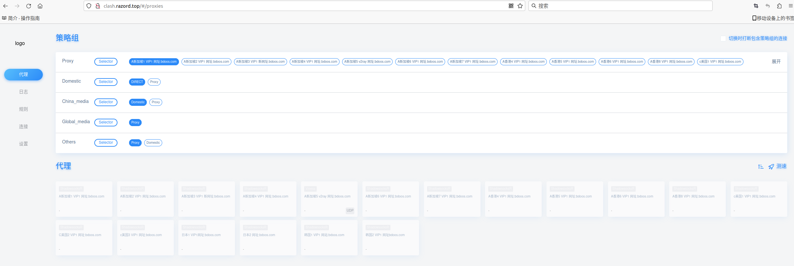

# Ubuntu常用工具
> [!Tip]
> 测试系统为 Ubuntu20.04

### 1  Clash 科学上网

Step 1:

打开终端，输入以下命令下载Clash

```bash
wget https://github.com/Dreamacro/clash/releases/download/v1.18.0/clash-linux-amd64-v1.18.0.gz
```

或者直接官网下载：https://github.com/Dreamacro/clash/releases 选择`clash-linux-amd64-v1.18.0.gz`


Step 2：

解压缩下载的文件

```bash
gunzip clash-linux-amd64-v1.17.0.gz
```

Step 3(Optional)：

使用以下命令将解压后的文件移动到 `/usr/local/bin` 目录，并重命名为 `clash`：

```bash
sudo mv clash-linux-amd64-v1.17.0 /usr/local/bin/clash
```

Step 4：

赋予 Clash 添加执行权限：

```bash
sudo chmod +x /usr/local/bin/clash
```

Step 5：

创建 clash 目录

查看 ~/.config 是否有 clash 目录，如果有则跳过此步；如果没有，使用以下命令创建 Clash 的配置文件目录：

```bash
mkdir -p ~/.config/clash
```

Step 6：

添加订阅地址

```bash
curl 订阅地址 > ~/.config/clash/config.yaml
```

> `订阅地址`找我要

订阅地址添加后如下图：


Step 7：

启动clash

在终端中输入`clash`启动clash，第一次会提示下载MMDB，如果下载速度慢，可以切换手机热点。下载好了之后就不用再下载了

```bash
Can't find MMDB, start download
```

Step 8：

配置 Ubuntu 网络代理，见下图




Step 9：

节点管理

在浏览器中输入：http://clash.razord.top/#/proxies 进入节点管理界面，见下图，可以选择节点




Step 10：

关闭 clash

在终端中使用`ctrl c`停止clash即可


### 2 Ubuntu常用软件

网盘链接：链接：https://pan.baidu.com/s/1z_NDuOqs2twZEiLzw0FRNw?