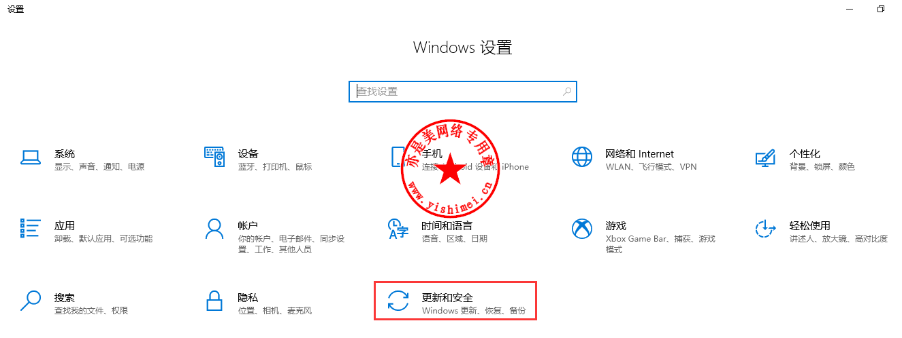
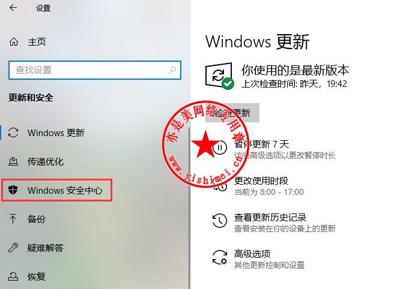
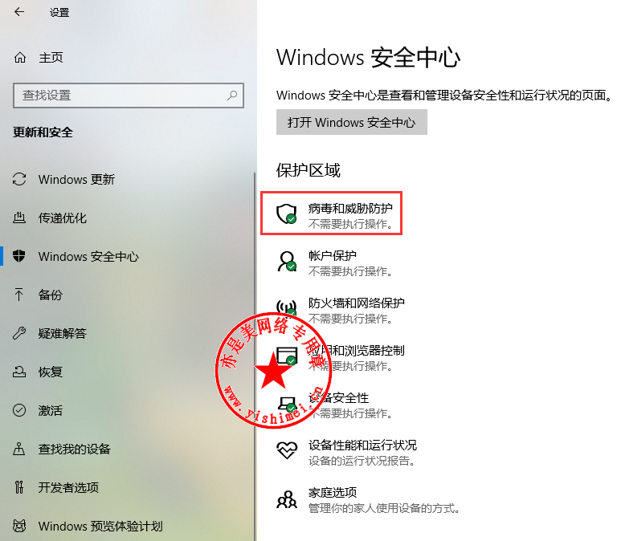
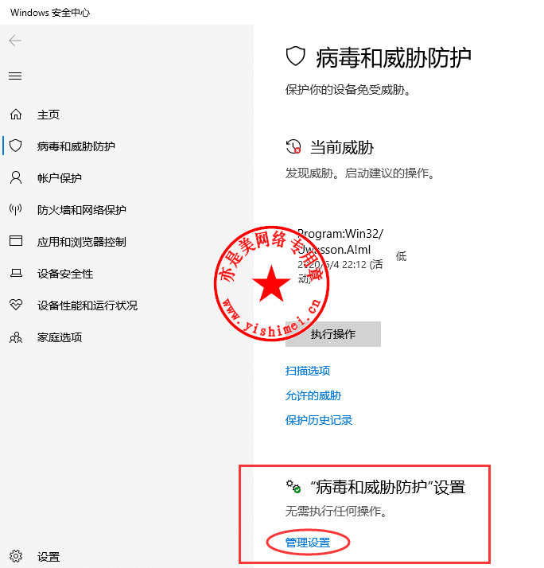
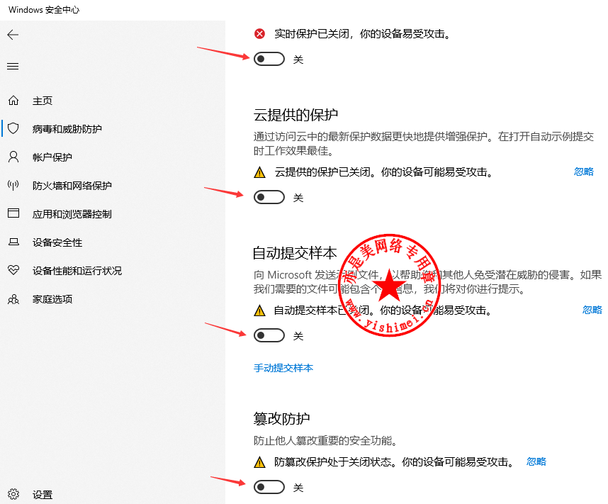

# Windows常用工具
> [!Tip]
> 测试系统为Win10，Windows下有些破解软件需要关闭系统的“病毒和威胁防护”，关闭方法见下

### 1  永久彻底的关闭win10、win11自带的windows defender杀毒功能

参考链接：http://www.yishimei.cn/network/426.html

---

首先我们右键win10、win11系统的开始菜单，选择“设置”，或者直接按下Win+i组合键，打开系统“设置”，

点击“更新和安全”，

点击左侧的“Windows安全中心”，

点击“病毒和威胁防护”，

找到“病毒和威胁防护”设置，点击“管理设置”，如上图所示，

将右侧的“实时保护”、“云提供保护”、“自动提交样本”、“篡改保护”四项全部手动关掉，如上图所示，

接下来我们打开一键关闭Windows Defender小工具，下载地址：

链接：https://pan.baidu.com/s/1jSV-FlEJrRuXsuvPVsru_Q?pwd=8888 提取码：8888 

点击“一键关闭”后，重启电脑就可以了~

至此，Windows Denfeder就彻底歇菜了，再也不会叨扰我们的系统了~

> [!Warning]
> 注意1：有些同学打开“Windows安全中心”后，右边是空白，无法进行操作，这时我们用一键开启关闭WD小工具中的开启功能先将WD开启，然后重启系统后就可以操作了~
> 
> 注意2：彻底关闭WD后，使用系统自带的Microsoft Edge浏览器还是会提示或阻止破解软件下载，可以选择“保留”，也可以换用其他浏览器下载，比如Google Chrome浏览器~
> 
> 注意3：不要直接使用一键关闭工具进行操作，而是要按照本站教程中的步骤先操作，然后再使用一键关闭工具进行关闭，步骤不能反了，如果反了，请参照“注意1”~

### 2 Windows常用软件

网盘链接：https://pan.baidu.com/s/1eEOM4rHxt_bYMHjQJNXrJw?

### 3 Windows科研软件
网盘链接：https://pan.baidu.com/s/1DGIuNeHSZlWLb2cZMtS1lA?

